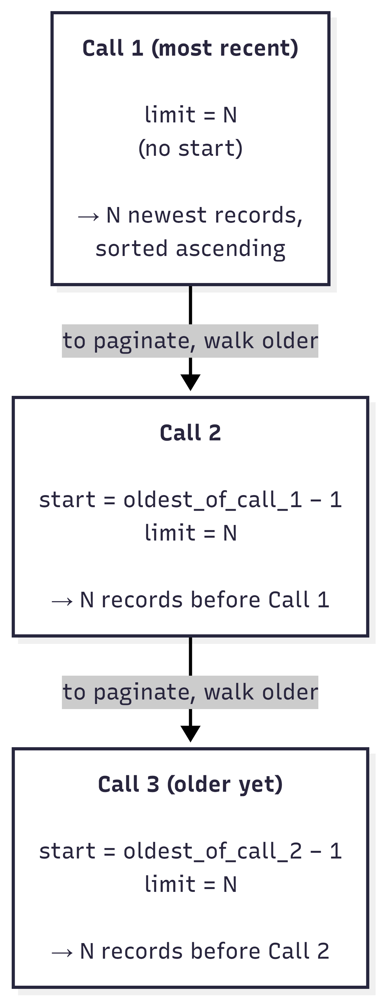

<h1>OCEΛNO <small><code>exchange-router-service</code></small></h1>


<div style="padding-top: 0px;">
  <a href="https://www.python.org/downloads/"></a>
  <a href="https://fastapi.tiangolo.com/"></a>
  <a href="https://opensource.org/licenses/MIT"></a>
</div>

<sub>
  <a href="../README.md">Introduction</a> &nbsp;•&nbsp; 
  <a href="Scope.md">Scope</a> &nbsp;•&nbsp; 
  <b>API Reference</b> &nbsp;•&nbsp; 
  <a href="Python_SDK.md">Python SDK</a> &nbsp;•&nbsp; 
  <a href="Troubleshooting.md">Troubleshooting</a> &nbsp;•&nbsp; 
  <a href="Exchange_Notes.md">Exchange Notes</a> &nbsp;•&nbsp; 
  <a href="System_Architecture.md">System Architecture</a> &nbsp;•&nbsp; 
  <a href="Capabilities_Contract.md">Capabilities Contract</a> &nbsp;•&nbsp; 
  <a href="Auditor_Guide.md">Auditor Guide</a> &nbsp;•&nbsp; 
  <a href="Contributor_Guide.md">Contributor Guide</a>
</sub>

<br>
<br>
<br>
<br>

## API Reference

The router exposes two interfaces on the same port. REST is request/response; WebSocket is real-time streaming.

*   **REST Base URI:** `http://localhost:8040`
*   **WebSocket Base URI:** `ws://localhost:8040/ws/{exchange}/{market_type}`

Worked response examples for every route, with the discrete vs continuous funding variants shown side-by-side, are in the [Response Shapes](#response-shapes) section below.


### Path Variables

*   `{exchange}`: Exchange identifier (e.g., `binance`, `bybit`).
*   `{market_type}`: Market category (`spot`, `linear`, `inverse`).
*   `{symbol}`: Trading pair (e.g., `BTCUSDT`).

<br>
<br>


## REST

The REST interface covers everything that is request/response based: service discovery, capability maps, historical data pulls, and point-in-time snapshots. Every endpoint returns a normalized JSON payload matching one of the schemas documented in Response Shapes below, regardless of which upstream exchange served the request.

Every quantitative record (Trade, Candle, OpenInterest, etc.) carries nested value objects with units and quote-currency conversions baked in; every record carries a `quote` field at the row level so it is interpretable in isolation. Funding rates live under a `kind: "discrete" | "continuous"` discriminator so a position-PnL calculation can branch on the funding model itself, with no exchange-specific code.

<br>

### Endpoints

#### Discovery

| Method | Route | Description | Params |
| :--- | :--- | :--- | :--- |
| `GET` | `/` | Service introspection: version, schema_version, and every registered exchange with its supported market types. | None |
| `GET` | `/status` | Service health check (thin slice of `/`). | None |
| `GET` | `/version` | Service version. | None |
| `GET` | `/exchanges` | Lists all active adapters. | None |
| `GET` | `/{exchange}` | Exchange overview: connectivity, supported market types, per-market capabilities, and `symbol_count`. | None |
| `GET` | `/{exchange}/status` | Adapter health string. Returns `{"status": "online", "exchange": name}`; does not poll the upstream exchange. | None |
| `GET` | `/{exchange}/capabilities` | Supported REST routes and WebSocket channels for an adapter. | None |
| `GET` | `/{exchange}/market_types` | Market types available on the exchange. | None |
| `GET` | `/{exchange}/{market_type}/markets` | Lite list of every tradable symbol with `base_asset`, `quote_asset`, `qty_unit`, `contract_size`, and `funding.kind`. On `linear` and `inverse`, only perpetuals are returned. Served from the in-memory adapter cache (refreshed at most once per 24h): no upstream calls on the request path. | None |
| `GET` | `/{exchange}/{market_type}/markets/{symbol}` | Full `SymbolInfo` for one symbol: precision, order limits, contract size, funding convention. | None |

#### Pricing

| Method | Route | Description | Params |
| :--- | :--- | :--- | :--- |
| `GET` | `/{exchange}/{market_type}/ticker/{symbol}` | 24h rolling window price and volume stats. | None |
| `GET` | `/{exchange}/{market_type}/book_ticker/{symbol}` | Best bid/ask price and quantity. | None |

#### Trades

| Method | Route | Description | Params |
| :--- | :--- | :--- | :--- |
| `GET` | `/{exchange}/{market_type}/trades/{symbol}` | Recent public trades. | `limit` |
| `GET` | `/{exchange}/{market_type}/agg_trades/{symbol}` | Aggregated trade history. | `start`, `limit` |

#### Orderbook

| Method | Route | Description | Params |
| :--- | :--- | :--- | :--- |
| `GET` | `/{exchange}/{market_type}/orderbook/{symbol}` | Current L2 orderbook snapshot. | `depth` |

#### Historical Data

| Method | Route | Description | Params |
| :--- | :--- | :--- | :--- |
| `GET` | `/{exchange}/{market_type}/candles/{symbol}` | OHLCV candles. | `interval`, `start`, `limit` |

#### Futures
*Linear and inverse market types only.*

| Method | Route | Description | Params |
| :--- | :--- | :--- | :--- |
| `GET` | `/{exchange}/{market_type}/mark_price/{symbol}` | Mark price, index price, and current funding view. | None |
| `GET` | `/{exchange}/{market_type}/liquidations/{symbol}` | Recent forced liquidation events. | `start`, `limit` |
| `GET` | `/{exchange}/{market_type}/funding_rate/{symbol}` | Historical funding rates. | `start`, `limit` |
| `GET` | `/{exchange}/{market_type}/open_interest/{symbol}` | Open interest history. On `linear` markets the route joins matching candles to populate the USD basis; on `inverse` it uses `contract_size` directly. | `period`, `start`, `limit` |
| `GET` | `/{exchange}/{market_type}/long_short_ratio/{symbol}` | Long/short account distribution. | `period`, `start`, `limit` |

<br>

### Pagination Semantics

Every endpoint that accepts a `start` query parameter (candles, agg_trades, funding_rate, open_interest, liquidations, long_short_ratio) treats it as an **inclusive backward-walking upper bound**:

* `?start=X&limit=N` returns up to N records with `timestamp <= X`, sorted ascending. X is the newest record in the response when present in the dataset.
* Omit `start` to get the most recent N records ending at "now".
* The response is always sorted ascending (oldest first), regardless of whether `start` was set.

The natural pagination loop for "load older" is therefore: pass the oldest timestamp you already have as the new `start`, request the next page, prepend to your view.

<div align="center">
  
  <p style="margin: 0;"><i>Each call's start anchor is the prior call's oldest record minus one; the response is always sorted oldest-first regardless of which call</i></p>
</div>

<br>

### Response Shapes

All REST responses are normalized to the same schema regardless of the upstream exchange. Timestamps are Unix milliseconds. Prices are floats in the row's `quote` currency. Quantitative fields (qty, volume, open_interest) are **nested value objects** that carry both the native upstream value and a quote-currency notional. WebSocket channels emit the same shapes, noted inline.

#### Interpretation Fields

Every quantitative record carries one or more categorical discriminator fields that change how the value should be read. Branching on these is how application code stays exchange-agnostic.

| Field | Where it appears | Value | What it means |
| :--- | :--- | :--- | :--- |
| `unit` | qty / volume / open_interest / SymbolInfo.qty_unit | `"base"` | `native` is in the base coin (BTC for BTCUSDT, etc.) |
|  |  | `"contract"` | `native` is a contract count; the same record carries `contract_size` for converting to USD |
| `usd_basis.method` | volume / open_interest | `"close"` | `usd = native × the row's own close`. The basis object's `close` and `close_ts` are null because the price is the row's own and is already visible to the reader. |
|  |  | `"candle_close"` | `usd` came from a separate candle join. The basis carries the actual `close` and `close_ts` used. Both are null if the join missed, in which case `usd` is null too while `native` is always populated. |
|  |  | `"contract_size"` | `usd = native × contract_size`, exact and price-independent. Used on inverse contracts where each contract represents a fixed quote-currency notional. |
| `funding.kind` | MarkPrice.funding / FundingRate.rate / SymbolInfo.funding | `"discrete"` | Settles at fixed cycles. `per_cycle × notional` is charged at `valid_until_ts`. |
|  |  | `"continuous"` | Accrues smoothly between samples. Compute paid via `per_cycle × notional × (overlap_ms / cycle_ms)` over your position window. |
| `account_scope` | LongShortRatio | `"top_traders"` | Only top-trader accounts per the upstream's classification. |
|  |  | `"all_accounts"` | Every account at the venue. |
|  |  | `"opaque"` | Upstream exposes only the ratio; `long_account` and `short_account` will be null. |
| `side` | Trade / AggTrade / Liquidation | `"buy"` / `"sell"` | Taker (aggressor) side. Universal across venues. |

The SDK helpers (`per_hour_view`, `funding_paid`) already branch on these fields, so application code does not have to. For which value each venue uses on which route, see [Exchange Notes](Exchange_Notes.md).

<br>

**Service root** &nbsp;·&nbsp; `GET /`
```json
{
  "service": "exchange-router-service",
  "version": "2.0.0",
  "status": "ok",
  "schema_version": 3,
  "exchanges": [
    {"name": "binance", "market_types": ["spot", "linear", "inverse"]},
    {"name": "bybit",   "market_types": ["spot", "linear", "inverse"]}
  ]
}
```

**Exchange overview** &nbsp;·&nbsp; `GET /{exchange}`
```json
{
  "exchange": "binance",
  "status": "ok",
  "market_types": [
    {
      "name": "linear",
      "symbol_count": 287,
      "capabilities": { "...": "per-route booleans and limits" }
    }
  ]
}
```

**Markets list** &nbsp;·&nbsp; `GET /{exchange}/{market_type}/markets`
```json
{
  "exchange": "binance",
  "market_type": "linear",
  "count": 287,
  "markets": [
    {
      "symbol": "BTCUSDT",
      "base_asset": "BTC",
      "quote_asset": "USDT",
      "qty_unit": "base",
      "contract_size": null,
      "funding": {"kind": "discrete"}
    }
  ]
}
```

The lite entry carries just enough metadata to enumerate and filter symbols without a per-symbol round trip. Use `/markets/{symbol}` for the full `SymbolInfo`.

**Symbol Info** &nbsp;·&nbsp; `GET /{exchange}/{market_type}/markets/{symbol}`
```json
{
  "symbol": "BTCUSD",
  "native_symbol": "BTCUSD_PERP",
  "base_asset": "BTC",
  "quote_asset": "USD",
  "price_precision": 1,
  "quantity_precision": 0,
  "min_qty": 1.0,
  "max_qty": 1000000.0,
  "min_notional": null,
  "qty_unit": "contract",
  "contract_size": 100.0,
  "funding": {"kind": "discrete"}
}
```

`symbol` is the routing-facing trading pair used across all router endpoints. `native_symbol` is the raw exchange symbol (e.g. `BTCUSD_PERP`, `PI_XBTUSD`) for cross-referencing back to the upstream API. `qty_unit` is `"base"` on spot/linear and `"contract"` on inverse; on inverse, `contract_size` carries the quote-asset notional per contract (commonly `100` or `1`, depending on the venue). `funding` is `null` on spot, `{"kind": "discrete"}` on discrete-funding futures, and `{"kind": "continuous"}` on continuous-funding futures. Per-venue specifics live in [Exchange Notes](Exchange_Notes.md).

Only tradeable symbols appear in `/markets` and `/markets/{symbol}`. Paused, halted, and offline instruments are filtered out at the adapter level, so a symbol's presence in the response is itself the liveness signal.

**Ticker** &nbsp;·&nbsp; `GET /ticker/{symbol}` &nbsp;·&nbsp; WS `ticker`
```json
{
  "symbol": "BTCUSDT",
  "market_type": "linear",
  "quote": "USDT",
  "price": 72154.30,
  "open_24h": 71800.00,
  "high_24h": 72500.00,
  "low_24h": 71200.00,
  "volume_24h": {
    "native": 12345.67,
    "unit": "base",
    "contract_size": null,
    "usd": 890123456.78,
    "usd_basis": {"method": "close", "close": null, "close_ts": null}
  },
  "price_change_percent": 0.49,
  "timestamp": 1712847600000
}
```

On inverse markets `volume_24h.unit` is `"contract"`, `contract_size` is populated, and `usd_basis.method` is `"contract_size"` (exact conversion via the fixed notional per contract).

**Book Ticker** &nbsp;·&nbsp; `GET /book_ticker/{symbol}` &nbsp;·&nbsp; WS `book_ticker`
```json
{
  "symbol": "BTCUSDT",
  "market_type": "linear",
  "quote": "USDT",
  "bid_price": 72154.10,
  "bid_qty": {"native": 0.512, "unit": "base", "contract_size": null, "usd": 36942.90},
  "ask_price": 72154.30,
  "ask_qty": {"native": 1.042, "unit": "base", "contract_size": null, "usd": 75184.78},
  "timestamp": 1712847600000
}
```

**Orderbook** &nbsp;·&nbsp; `GET /orderbook/{symbol}` &nbsp;·&nbsp; WS `orderbook`
```json
{
  "symbol": "BTCUSDT",
  "market_type": "linear",
  "quote": "USDT",
  "bids": [[72154.10, 0.512], [72154.00, 1.200]],
  "asks": [[72154.30, 1.042], [72154.40, 0.350]],
  "qty_unit": "base",
  "timestamp": 1712847600000
}
```

Per-level qty stays as a flat `[price, qty]` pair. Doubling depth-200 books just to embed per-level USD is a poor cost/benefit trade; consumers compute it as `price × qty` locally.

**Trade** &nbsp;·&nbsp; `GET /trades/{symbol}` (list) &nbsp;·&nbsp; WS `trades`
```json
{
  "id": "4851723",
  "symbol": "BTCUSDT",
  "market_type": "linear",
  "quote": "USDT",
  "price": 72154.30,
  "qty": {"native": 0.012, "unit": "base", "contract_size": null, "usd": 865.85},
  "side": "buy",
  "timestamp": 1712847600123
}
```

On inverse markets `qty.unit` is `"contract"`, `contract_size` is populated, and `qty.usd = native × contract_size` (price-independent). Worked example: with `contract_size=100`, a 5-contract trade is exactly `qty.usd = 500` regardless of price. With `contract_size=1`, `qty.native == qty.usd` for the same reason. The actual contract size per instrument comes from `GET /{exchange}/{market_type}/markets/{symbol}` and is reflected on the trade row itself.

**Aggregated Trade** &nbsp;·&nbsp; `GET /agg_trades/{symbol}` (list) &nbsp;·&nbsp; WS `agg_trades`
```json
{
  "agg_id": "8192456",
  "symbol": "BTCUSDT",
  "market_type": "linear",
  "quote": "USDT",
  "price": 72154.30,
  "qty": {"native": 0.153, "unit": "base", "contract_size": null, "usd": 11039.61},
  "first_trade_id": "4851720",
  "last_trade_id": "4851725",
  "side": "buy",
  "timestamp": 1712847600123
}
```

**Candle** &nbsp;·&nbsp; `GET /candles/{symbol}` (list)
```json
{
  "symbol": "BTCUSDT",
  "market_type": "linear",
  "quote": "USDT",
  "interval": "1h",
  "timestamp": 1712847600000,
  "open": 72100.00,
  "high": 72200.00,
  "low": 72050.00,
  "close": 72154.30,
  "volume": {
    "native": 48.21,
    "unit": "base",
    "contract_size": null,
    "usd": 3479154.27,
    "usd_basis": {"method": "close", "close": null, "close_ts": null}
  }
}
```

On linear/spot, `volume.usd = native × close` (close-as-VWAP-proxy, approximate). On inverse, `volume.usd = native × contract_size` (exact). The `usd_basis.method` field tells you which.

**Mark Price** &nbsp;·&nbsp; `GET /mark_price/{symbol}` &nbsp;·&nbsp; WS `mark_price` &nbsp;·&nbsp; *linear/inverse only*

Discrete-funding variant:
```json
{
  "symbol": "BTCUSDT",
  "market_type": "linear",
  "quote": "USDT",
  "mark_price": 72153.85,
  "index_price": 72150.10,
  "funding": {
    "kind": "discrete",
    "per_cycle": 0.0001,
    "cycle_ms": 28800000,
    "valid_until_ts": 1712851200000
  },
  "timestamp": 1712847600000
}
```

Continuous-funding variant:
```json
{
  "symbol": "XBTUSD",
  "market_type": "inverse",
  "quote": "USD",
  "mark_price": 72153.85,
  "index_price": 72150.10,
  "funding": {
    "kind": "continuous",
    "per_cycle": 0.0000118,
    "cycle_ms": 3600000,
    "valid_until_ts": 1712851200000
  },
  "timestamp": 1712847600000
}
```

`funding.kind` is the discriminator. On `discrete`, `per_cycle` is the estimated rate that will be charged at the next settlement (`valid_until_ts`). On `continuous`, `per_cycle` is the instantaneous per-cycle-equivalent accrual sampled at `timestamp`; partial holds pay proportionally. The SDK's `funding_paid()` helper handles both branches correctly.

**Funding Rate** &nbsp;·&nbsp; `GET /funding_rate/{symbol}` (list)

Discrete:
```json
{
  "symbol": "BTCUSDT",
  "market_type": "linear",
  "quote": "USDT",
  "rate": {
    "kind": "discrete",
    "per_cycle": 0.0001,
    "cycle_ms": 28800000
  },
  "timestamp": 1712847600000
}
```

Continuous:
```json
{
  "symbol": "XBTUSD",
  "market_type": "inverse",
  "quote": "USD",
  "rate": {
    "kind": "continuous",
    "per_cycle": 0.0000118,
    "cycle_ms": 3600000
  },
  "timestamp": 1712847600000
}
```

Discrete rows are settlement events; the rate was charged at `timestamp`. Continuous rows are sample observations; no charge happened at `timestamp`, just an observation of the instantaneous rate.

**Open Interest** &nbsp;·&nbsp; `GET /open_interest/{symbol}` (list)

Linear (USD basis from joined candle close):
```json
{
  "symbol": "BTCUSDT",
  "market_type": "linear",
  "quote": "USDT",
  "interval": "1h",
  "open_interest": {
    "native": 104094.481,
    "unit": "base",
    "contract_size": null,
    "usd": 7705187987.55,
    "usd_basis": {"method": "candle_close", "close": 74021.10, "close_ts": 1712847600000}
  },
  "timestamp": 1712847600000
}
```

Inverse (USD basis from fixed contract_size):
```json
{
  "symbol": "BTCUSD",
  "market_type": "inverse",
  "quote": "USD",
  "interval": "1h",
  "open_interest": {
    "native": 11678174.0,
    "unit": "contract",
    "contract_size": 100.0,
    "usd": 1167817400.0,
    "usd_basis": {"method": "contract_size", "close": null, "close_ts": null}
  },
  "timestamp": 1712847600000
}
```

On linear markets, the route handler fetches matching candles after the OI rows arrive (sequential, not parallel) and joins them by timestamp to populate the row's `usd_basis` block (`method: "candle_close"`, plus the joined `close` and `close_ts`) and derive `usd = native × close`. If the candle fetch itself fails, the route logs an exception and returns the OI rows with `usd` left `null`. If the fetch succeeds but a given OI row has no matching candle, the row passes through silently with `usd` `null` and `usd_basis.close` / `close_ts` both `null`. The raw `native` is always populated.

**Liquidation** &nbsp;·&nbsp; `GET /liquidations/{symbol}` (list) &nbsp;·&nbsp; WS `liquidations`
```json
{
  "symbol": "BTCUSDT",
  "market_type": "linear",
  "quote": "USDT",
  "side": "sell",
  "price": 71820.00,
  "qty": {"native": 2.35, "unit": "base", "contract_size": null, "usd": 168777.00},
  "timestamp": 1712847598000
}
```

**Long/Short Ratio** &nbsp;·&nbsp; `GET /long_short_ratio/{symbol}` (list)
```json
{
  "symbol": "BTCUSDT",
  "market_type": "linear",
  "interval": "5m",
  "ratio": 1.82,
  "long_account": 0.645,
  "short_account": 0.355,
  "account_scope": "all_accounts",
  "timestamp": 1712847600000
}
```

No `quote` field; this metric is dimensionless. `account_scope` carries the upstream's aggregation level: `"top_traders"`, `"all_accounts"`, or `"opaque"` when no breakdown is exposed. Per-exchange specifics live in [Exchange Notes](Exchange_Notes.md). Cross-exchange comparisons require matching scope.

<br>

### HTTP Status Codes

| Code | Status | Meaning |
| :--- | :--- | :--- |
| **200** | Success | Request succeeded and the payload was normalized. |
| **400** | Bad Request | Invalid parameter, unsupported market type, or upstream rejection. |
| **404** | Not Found | Exchange not registered. |
| **422** | Unprocessable Entity | Path or query parameter failed validation (e.g. an unrecognised `market_type` value). |
| **500** | Internal Error | Upstream connection failure after retries, or unhandled error. |
| **501** | Not Implemented | Route not supported by the target adapter on this market type. |
| **503** | Service Unavailable | Upstream rate-limit or ban window active. Carries a `Retry-After` header (seconds) when the adapter knows the wait. Retry later; the request itself was valid. |

<br>

All error responses include a `detail` field describing what went wrong:

```json
{"detail": "Exchange 'foo' not found or not enabled."}
```

Parameter validation errors also carry an `error` field set to `"Invalid Request"`:

```json
{"error": "Invalid Request", "detail": "Interval '2m' is not valid for binance spot candles."}
```

The router never masks upstream error detail. If the underlying exchange returns a specific message, it is passed through in `detail`.

<br>
<br>

## WebSocket

The WebSocket interface covers everything REST does not. It carries real-time streams from the exchange pushed through without polling. The two interfaces share a port and a schema, so a `ticker` WebSocket message looks identical to a `GET /ticker/{symbol}` response body, and you can pick whichever fits the workload.

Connect to `ws://localhost:8040/ws/{exchange}/{market_type}` and send a JSON subscription payload. The server starts streaming as soon as the upstream exchange connection is established. There is no acknowledgement message, just data.

<br>

### Protocol Rules

* **One subscription per connection.** A connection is bound to a single `(channel, symbol)` tuple. To subscribe to more than one, open additional connections. The internal `StreamManager` still shares a single upstream exchange connection between any clients that pick the same tuple, so this does not create redundant upstream connections.
* **No unsubscribe message.** Close the connection to unsubscribe. The server tears down resources immediately.
* **No client heartbeat required.** Exchange-specific ping/pong handling is abstracted inside the adapter. The server does not close idle connections on its own.
* **Stream payloads match REST shapes.** A `ticker` subscription yields the same JSON object as `GET /ticker/{symbol}`, including the nested value objects and the `quote` field. See the response shapes above.
* **Availability is not uniform.** Not every channel is available on every exchange or market type. Check `GET /{exchange}/capabilities` before subscribing.

<br>

### Channels

| Channel | Description | Payload |
| :--- | :--- | :--- |
| `ticker` | 24h rolling price and volume stats. | `{"channel": "ticker", "symbol": "BTCUSDT"}` |
| `book_ticker` | Best bid/ask updates. | `{"channel": "book_ticker", "symbol": "BTCUSDT"}` |
| `trades` | Individual public trade executions. | `{"channel": "trades", "symbol": "BTCUSDT"}` |
| `agg_trades` | Aggregated trade events. | `{"channel": "agg_trades", "symbol": "BTCUSDT"}` |
| `orderbook` | L2 orderbook depth updates. | `{"channel": "orderbook", "symbol": "BTCUSDT"}` |
| `mark_price` | Mark price and funding view updates. | `{"channel": "mark_price", "symbol": "BTCUSDT"}` |
| `liquidations` | Real-time liquidation events. | `{"channel": "liquidations", "symbol": "BTCUSDT"}` |

<br>

### Close Codes

| Code | Meaning |
| :--- | :--- |
| **1003** | Subscription payload rejected. Three causes: missing `channel` or `symbol`, channel name not in the supported set (`ticker`, `book_ticker`, `mark_price`, `agg_trades`, `trades`, `orderbook`, `liquidations`), or the channel exists but `ws: False` for this exchange/market in the capability map. |
| **1008** | Exchange not registered, or market type not supported by that adapter. |
| **1011** | Upstream exchange connection lost. Reconnect and re-subscribe. |

<br>
<br>

## Examples

For full parameter details see the endpoint tables above and [Parameter defaults](#parameter-defaults).

REST, with `curl`:

```bash
curl http://localhost:8040/
curl http://localhost:8040/exchanges
curl http://localhost:8040/binance/capabilities
curl http://localhost:8040/binance/linear/markets
curl http://localhost:8040/binance/inverse/markets/BTCUSD
curl http://localhost:8040/binance/spot/ticker/BTCUSDT
curl "http://localhost:8040/bybit/linear/candles/ETHUSDT?interval=1h&limit=500"
```

The block above hits, in order: service introspection, the active-adapter list, Binance's capability map (check this before building clients), the lite markets list (served entirely from cache, zero upstream calls), the full `SymbolInfo` for one symbol, a spot ticker, and 500 1h candles for a Bybit linear pair.

WebSocket, with `wscat`:

```bash
wscat -c ws://localhost:8040/ws/binance/spot
> {"channel": "trades", "symbol": "BTCUSDT"}
```

Trade events stream immediately after the payload is sent.

<br>
<br>

## Parameter defaults

Default values applied when the caller omits the query parameter. There is no router-side maximum: the cap, where one exists, is per-exchange and lives in the `/capabilities` map.

| Parameter | Min | Max | Default |
| :--- | ---: | ---: | ---: |
| `depth` (orderbook) | 1 | * | 20 |
| `limit` (trades) | 1 | * | 100 |
| `limit` (agg_trades) | 1 | * | 500 |
| `limit` (candles) | 1 | * | 100 |
| `limit` (open_interest) | 1 | * | 30 |
| `limit` (funding_rate) | 1 | * | 100 |
| `limit` (liquidations) | 1 | * | 100 |
| `limit` (long_short_ratio) | 1 | * | 30 |

`*` Determined by the capabilities map for each exchange and route. Paginated routes (`candles`, `agg_trades`, `funding_rate`, `open_interest`, `liquidations`, `long_short_ratio`) have no router-side ceiling: the adapter walks back through history bounded by upstream retention. Non-paginated routes (`trades`, `orderbook`) clamp to the per-exchange `max_limit` (`max_depth` for orderbook) declared in capabilities.

Per-venue semantic quirks (funding cycle `valid_until_ts` meaning, ticker timestamp lag on Binance, trade-id formats, 1000-prefix tokens, long/short breakdown availability) live in [Exchange Notes](Exchange_Notes.md).
