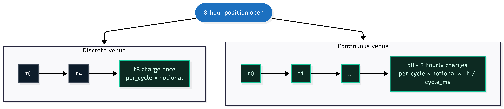

<h1>OCEΛNO <small><code>exchange-router-service</code></small></h1>


<div style="padding-top: 0px;">
  <a href="https://www.python.org/downloads/"></a>
  <a href="https://fastapi.tiangolo.com/"></a>
  <a href="https://opensource.org/licenses/MIT"></a>
</div>

<sub>
  <a href="../README.md">Introduction</a> &nbsp;•&nbsp; 
  <a href="API_Reference.md">API Reference</a> &nbsp;•&nbsp; 
  <a href="Python_SDK.md">Python SDK</a> &nbsp;•&nbsp; 
  <b>Exchange Notes</b> &nbsp;•&nbsp; 
  <a href="System_Architecture.md">System Architecture</a> &nbsp;•&nbsp; 
  <a href="Auditor_Guide.md">Auditor Guide</a> &nbsp;•&nbsp; 
  <a href="Contributor_Guide.md">Contributor Guide</a>
</sub>

<br>
<br>
<br>
<br>

## Exchange Notes

Quirks per exchange that callers can observe: symbol formats, fields the upstream does not expose, retention windows that bound historical queries, and unit semantics that survive normalisation. The schema is uniform across exchanges; the data behind it is not always. The router never invents data, so missing fields come back as `0` or an empty string and queries past retention come back as an empty list.

<br>
<br>

## Shared Conventions

<br>

### Symbol normalization

All adapters normalize to bare trading pairs (`BTCUSDT`, `ETHUSDT`) with no exchange-specific suffixes. The market type in the URL path conveys that context, so a symbol like `BTCUSDT` means different things depending on whether the path is `/binance/spot/`, `/binance/linear/`, or `/binance/inverse/`.

`GET /{exchange}/{market_type}/markets` returns a dict `{exchange, market_type, count, markets}` where `markets` is an array of **lite** entries carrying `symbol`, `base_asset`, `quote_asset`, `qty_unit`, `contract_size`, and `funding`. To get the full specs for one symbol (including `native_symbol`, the raw symbol as it appears on the exchange's own API), call `GET /{exchange}/{market_type}/markets/{symbol}`:

```json
{
  "symbol": "BTCUSD",
  "native_symbol": "BTCUSD_PERP",
  ...
}
```

Examples of the mapping: `BTCUSD` (model) ↔ `BTCUSD_PERP` (upstream), `XBTUSD` ↔ `PF_XBTUSD`, `BTCUSD` ↔ `BTC-USD-SWAP`. Use `native_symbol` when you need to cross-reference a normalized symbol back to the exchange's documentation or raw API. Per-venue rules for what gets stripped or rewritten live in the venue sections below.

<br>

### Perpetuals only on contract markets

For `linear` and `inverse` market types, both `/markets` and `/markets/{symbol}` return perpetual contracts only. Quarterly and dated futures are excluded by every adapter. Spot markets are unaffected and return every active pair.

<br>

### Data fidelity rule

The router never invents data. When an upstream omits a field, the router surfaces the gap honestly rather than guessing:

* Missing string fields come back as `""`.
* Missing numeric fields come back as `0` or `null`, depending on the model.
* Missing list responses come back as `[]`, never a synthesized "best guess".
* Queries past upstream retention return an empty list.

`SymbolInfo` fields like `min_notional`, `max_qty`, `base_asset`, and `quote_asset` follow this rule: they default to `0` or `""` when the upstream does not return them, and each exchange's section below documents which fields tend to be missing. A consumer reading `0` on a rarely-populated field should not read it as "the exchange said zero"; it usually means the exchange did not return the field at all.

The same rule applies to derived values such as `usd` on `open_interest`: on linear markets it is joined from a same-period candle's close, and if that join misses, `usd` comes back `null` with `native` still populated. The router does not substitute a stale close, a ticker price, or a back-of-envelope estimate.

<br>

### Open interest units differ by exchange and market

`OpenInterest.open_interest` is the upstream-native count of open positions. There is no quote-currency / USD slot in the model: only some venues expose one, and on the rest the field would be a perpetual zero pretending to mean "$0 of OI." Several unit conventions exist across the matrix:

| Exchange / market | `unit` | `native` is in | example BTC perp |
| :--- | :--- | :--- | :--- |
| Binance LINEAR  | `base`     | base coin                                                                  | `94,201.6` BTC |
| Binance INVERSE | `contract` | contracts (`contract_size` = $100 for BTCUSD)                              | `11,674,843` contracts ≈ $1.17B nominal |
| Bybit LINEAR    | `base`     | base coin                                                                  | `51,528` BTC |
| Bybit INVERSE   | `contract` | contracts (`contract_size` = $1)                                           | `403,155,610` contracts = $403M nominal |
| Kraken LINEAR (PF\_\*)   | `base`     | base coin                                                         | `1,898.7` BTC |
| Kraken INVERSE (PI\_\*)  | `contract` | contracts (`contract_size` = $1)                                  | `2,604,624` contracts = $2.6M nominal |
| KuCoin LINEAR   | `base`     | base coin (adapter pre-multiplies upstream contracts × multiplier)         | `30,361` BTC (= 30,361,348 contracts × 0.001) |
| KuCoin INVERSE  | `contract` | contracts (`contract_size` = $1)                                           | `120,701,769` contracts = $121M nominal |
| OKX LINEAR      | `base`     | base coin (adapter reads upstream's `oiCcy` column directly)               | `34,223.4` BTC |
| OKX INVERSE     | `contract` | contracts (`contract_size` = `ctVal`, $100 for BTC-USD-SWAP)               | `5,847,300` contracts = $584.7M nominal |

Each open-interest row carries a `usd` nominal in its `open_interest` value object: inverse (contract-unit) rows multiply contracts by `contract_size`, and linear (base-unit) rows join to a same-period candle close, recorded in `usd_basis`. When no matching candle is found the router leaves `usd` null rather than guessing it.

<br>

### Pagination is always backward-walking

Every endpoint that takes `start` follows the [backward-walking pagination contract](API_Reference.md#pagination-semantics); per-venue upstream mechanics differ but the user-visible behavior is identical. Where the upstream walks forward only, the adapter computes a synthetic forward start, fetches a window, and truncates. Backward-anchored requests on forward-walking upstreams are slightly slower than on natively-backward ones.

<br>

### Rate-limit and ban protection

User-facing behaviour lives here; the backoff and fail-fast flow is in [System Architecture](System_Architecture.md#rate-limiting); implementation patterns (header-driven proactive, reactive on rejection, minimum-spacing, per-adapter fail-fast thresholds) live in [Contributor Guide](Contributor_Guide.md#rate-limit-headers-and-proactive-backoff).

Every adapter handles rate-limit and ban behaviour transparently. You can call any route at full speed; a steady stream runs as fast as upstream allows, a burst slows down on its own, and a hard ban window surfaces as an immediate fail-fast error until it clears. No per-call sleep loops or client retry logic needed. Per-exchange retry and ban specifics live in each exchange's section below.

<br>

### Trade and timestamp conventions

Trade `side` is always normalized to `"buy"` or `"sell"` (taker side). Timestamps are always Unix milliseconds. Orderbook levels are `[price, size]` tuples; `size` follows the same unit as `qty` for the same market, see each exchange's section for the per-market specifics.

<br>

### Ticker `timestamp` semantics

Each adapter exposes the most upstream-faithful timestamp for `Ticker.timestamp`:

- **Every adapter except Binance**: response server time (within ~1s of wall clock).
- **Binance**: the `closeTime` field from `/ticker/24hr`. Empirically lags wall clock by 5-10 seconds because Binance's 24-hour rolling statistics pipeline aggregates with non-zero delay. The lag is a property of Binance's stats pipeline, not router behavior.

Consumers using `ticker.timestamp` to gauge data freshness across exchanges should expect Binance to look 5-10s "older" than the others. The price data itself is real-time; only the timestamp reflects stats-aggregation delay.

<br>

### Trade `id` formats

`Trade.id` and `AggTrade.agg_id` are exchange-specific opaque strings. Treat them as identity keys, not numbers. Per-exchange formats:

| Exchange | Format | Example |
| :--- | :--- | :--- |
| Binance | numeric integer string | `"6354281581"` |
| OKX | numeric integer string | `"1013326135"` |
| Bybit | UUID with hyphens | `"f960a6cf-2bcb-5f4e-9881-49a724a253dd"` |
| KuCoin | large integer string | `"1933627152931"` |
| Kraken spot | numeric integer string (upstream `trade_id`; timestamp-based fallback on rows that omit it) | `"61044952"` |
| Kraken futures | UUID via `uid` | `"ab32ca5f-e761-4a6d-a094-1d3f4aa8693c"` |

Consumers parsing `id` as integer will fail on Bybit and Kraken futures. Always store as string.

<br>

### Funding cycle and `valid_until_ts`

For the `kind` discriminator semantics see [Interpretation Fields](API_Reference.md#interpretation-fields) in the API Reference. `FundingCurrent.valid_until_ts` is the timestamp after which the current `per_cycle` rate is no longer the "current" rate, but the precise meaning differs per upstream:

| Exchange | typical `cycle_ms` | Meaning of `valid_until_ts` |
| :--- | ---: | :--- |
| Discrete-funding venues | 28,800,000 (8h) | Discrete settlement cycle. Most pairs are 8h, but the value varies per symbol (some pairs settle every 4h); each adapter caches the per-symbol interval from the upstream's instruments endpoint. On most discrete-funding adapters `valid_until_ts` is the next settlement boundary (less than one cycle ahead); on OKX it is the next-next boundary (roughly one to two cycles ahead, because OKX publishes the upcoming rate further in advance). |
| Continuous-funding venues | 3,600,000 (1h) | End of the current hourly accrual window. The rate accrues across the window rather than settling at a boundary. Currently used by Kraken futures. |

A consumer that does `next_settlement = now + cycle_ms` will be wrong on OKX and Kraken. Always use `valid_until_ts` as the authoritative deadline. To compute a uniform per-hour rate across all exchanges, divide `per_cycle` by `cycle_ms / 3_600_000`.

<br>

### 1000-prefix symbols (PEPE, SHIB, FLOKI)

Some venues quote sub-cent tokens as 1000-units to keep prices in a tradable range:
- **Binance, Bybit**: list as `1000PEPEUSDT`, `1000SHIBUSDT`. The reported price is per 1000 tokens.
- **OKX, KuCoin**: list as `PEPEUSDT`, `SHIBUSDT`. The reported price is per single token (with many leading zeros).

The router faithfully exposes whatever the upstream names the symbol. A consumer querying PEPE on multiple venues must map symbols accordingly: `1000PEPEUSDT` on Binance and Bybit, `PEPEUSDT` on OKX and KuCoin. Underlying USD volume math is internally consistent on each exchange.

<br>

### Long/short ratio account breakdown

Kraken's upstream exposes only the `ratio` scalar; `long_account` and `short_account` come back `null`. Every other adapter populates both account fields (decimals summing to roughly 1.0) alongside `ratio`. Consumers needing the breakdown across all venues should branch on the presence of `long_account`, not on exchange name.

<br>
<br>

## Binance

<br>

### Symbol format

Binance COIN-M (inverse) perpetuals carry a `_PERP` suffix in the exchange API (`BTCUSD_PERP`, `ETHUSD_PERP`). The router normalizes them to bare pairs (`BTCUSD`, `ETHUSD`). Use the `native_symbol` field on `/markets/{symbol}` responses if you need to cross-reference back to Binance's docs.

<br>

### Liquidations REST is disabled

Forced liquidation history is not available via public REST. The endpoints (`/fapi/v1/allForceOrders` on USDM, `/dapi/v1/allForceOrders` on COINM) require authentication, so `liquidations.rest` is `False` for both linear and inverse. The WebSocket stream (`forceOrder@arr`) is public, so `liquidations.ws` is `True`.

<br>

### COIN-M `qty` and `volume` are in contracts

For COIN-M (inverse) perpetuals, `qty.native` and `volume.native` are reported in contracts, not the base asset. For `BTCUSD_PERP`, 1 contract represents 100 USD of notional. The native count stays in contracts; the same record carries `contract_size` and `usd = native × contract_size` per the standard inverse layout, and the per-instrument multiplier is on `/markets/{symbol}` as `contract_size`. Divide `usd` by `price` if you need a base-asset volume. USD-M (linear) and SPOT report `qty` and `volume` in the base asset directly.

<br>
<br>

## Bybit

Bybit uses bare-pair symbols natively (`BTCUSDT`, `ETHUSDT`) on both spot and contracts; `native_symbol` matches `symbol` everywhere.

<br>

### IP bans

Bybit returns HTTP 403 (not 429) on persistent rate-limit violations. These are IP bans on the order of 10 minutes. The router fails the triggering request immediately and rejects subsequent requests with HTTP 503 (plus a `Retry-After` header) until the ban window has passed. Soft per-endpoint limits are handled internally with brief backoff and retry.

<br>

### Inverse `volume24h` and `turnover24h` semantics

For inverse perpetuals (`BTCUSD`, `ETHUSD`), Bybit reports `volume24h` in **contract count** (each contract = 1 USD on Bybit inverse) and `turnover24h` in the **base coin** (BTC). The adapter lands `Ticker.volume_24h.native` from `volume24h` directly, sets `volume_24h.unit` to `"contract"` on inverse, sets `volume_24h.contract_size` to `1.0`, and resolves `volume_24h.usd` via `native × contract_size` (so the USD figure is exact, not a derivation from `turnover24h`). Spot and linear follow the conventional layout (`volume24h` = base, `volume_24h.unit = "base"`, USD from `close × native`). The `usd_basis.method` field tells you which conversion ran.

<br>

### Long/short ratio derivation

The Bybit account-ratio endpoint returns `buyRatio` and `sellRatio` directly. The router maps `long_account = buyRatio` and `short_account = sellRatio`, and computes `ratio = buyRatio / sellRatio`. This is the inverse of the OKX convention (where the upstream sends a single `ratio` and the router derives the accounts).

<br>

### Long/short ratio `start` handling

The adapter passes `endTime` to `/v5/market/account-ratio` like any other paginated route, but whether the upstream honours that anchor is not consistently documented by Bybit. Compare returned timestamps against the requested anchor before assuming the response is actually historical; if Bybit returns the most recent window regardless of `start`, the rows still parse cleanly and the capability map's `paginated: True` reflects the adapter's intent rather than a guaranteed upstream behaviour.

<br>
<br>

## Kraken

<br>

### Legacy asset codes stay literal

Kraken uses legacy asset codes on its REST API: Bitcoin is `XBT`, Dogecoin is `XDG`. The router preserves these in normalized symbols, so Bitcoin on Kraken is `XBTUSD` / `XBTUSDT`, not `BTCUSD` / `BTCUSDT`. The v2 WebSocket API requires the modern names (`BTC`, `DOGE`); the adapter translates internally for the WS handshake only, never on the user-facing model. Pass `XBT...` / `XDG...` symbols in router requests that target Kraken; pass `BTC...` / `DOGE...` everywhere else.

<br>

### Candle history limits

The Kraken spot OHLC endpoint has a hard ceiling of 720 candles per request with no pagination support. Requests above this limit silently return only the most recent 720. Linear and inverse candles use the Futures chart API and paginate normally; the chart API labels candles by bucket open time and includes the in-progress bucket, which the router passes through unchanged, so Kraken futures candle timestamps line up with every other venue's.

<br>

### Inverse and linear `/markets/{symbol}` base/quote derivation

The Kraken Futures `/instruments` endpoint returns `baseCurrency`/`quoteCurrency` as `null` on both `PF_*` (linear / multi-collateral) and `PI_*` (inverse) perpetuals; the `underlying` field is a reference-rate identifier like `rr_xbtusd`, not a currency code. The router parses the model symbol against a fixed quote-currency list (`USDT, USDC, USD, EUR, GBP, JPY, CHF, CAD, AUD`) and populates `base_asset`/`quote_asset` from that split. So `PF_XBTUSD` → `base_asset=XBT`, `quote_asset=USD`. Symbols whose suffix isn't in that list will fall through to empty strings.

<br>

### Spot `price_change_percent` is "since UTC midnight", not rolling 24h

Kraken's spot ticker exposes `o` = "today's opening price" (UTC midnight) but no rolling 24h-ago open. The router fills `Ticker.open_24h` with that field and computes `price_change_percent` as `(price - o) / o * 100`. So during the early hours of the UTC day the change reads as a much smaller window than rolling-24h venues. Cross-exchange diffs around 00:00-04:00 UTC will show Kraken with a noticeably smaller `|price_change_percent|` than venues that use a true rolling-24h window. Fetching a 24h-ago candle to derive a true rolling change is one extra request per ticker call; the router does not pay that cost on every snapshot.

<br>

### Inverse `vol24h` and `volumeQuote` semantics

For Kraken inverse perpetuals (`PI_*`), the upstream returns `vol24h` as the **contract count** (each contract = 1 USD on Kraken inverse). `Ticker.volume_24h` lands as `{native: vol24h, unit: "contract", contract_size: 1.0, usd: native × contract_size, usd_basis: {method: "contract_size"}}`. Because `contract_size = 1`, `usd == native` numerically, which is the expected "200 == 200" pattern, not a bug. Linear / multi-collateral perpetuals (`PF_*`) follow the conventional layout: `vol24h` is the base coin, `volume_24h.unit = "base"`, USD derived from close × native.

<br>

### Funding shape and rate conversion

Kraken Futures uses [continuous funding](API_Reference.md#interpretation-fields); every Kraken futures `MarkPrice.funding` and `FundingRate.rate` carries `kind: "continuous"`, `cycle_ms: 3_600_000` (hourly sampling window, not a settlement schedule).

<div align="center">
  
  <p style="margin: 0;"><i>Discrete venues charge once at settlement; continuous venues accrue across sample windows over the same position</i></p>
</div>

<br>

Kraken's upstream exposes funding rates as an **absolute** value (`fundingRate`, in counter-currency per contract per period) on `/tickers`, not the dimensionless per-period rate that discrete-funding venues typically report. The historical-funding-rates endpoint exposes a `relativeFundingRate` field that **is** dimensionless and per-period. The adapter uses `relativeFundingRate` directly in `get_funding_rate`, and in `get_mark_price` converts the absolute `fundingRate` via `relative = fundingRate / markPrice` (linear `PF_*`) or `relative = fundingRate × markPrice` (inverse `PI_*`). After conversion, Kraken funding rates land in the same `~10⁻⁵-10⁻⁴` per-hour-equivalent range as discrete venues' per-cycle figures.

For cross-exchange comparison without branching on `kind`, use the SDK's `per_hour_view(row)` helper (see [Python SDK → Helpers](Python_SDK.md#helpers-for-funding-math)). For computing funding paid by a position over a window, use `funding_paid(rows, t_open, t_close, notional)`.

<br>
<br>

## KuCoin

<br>

### Symbol format

KuCoin spot uses dash-separated pairs (`BTC-USDT`). Futures use a contract suffix `M` on the concatenated form: `XBTUSDTM` for USDT-margined linear, `XBTUSDM` for USD-margined inverse. The router strips the dash on spot and the trailing `M` on futures, so normalized symbols are bare pairs (`BTCUSDT`, `XBTUSDT`, `XBTUSD`). Base-currency codes are passed through literally, so KuCoin's `XBT` (Bitcoin) stays as `XBT` in normalized symbols. Use `native_symbol` on `/markets/{symbol}` to round-trip back to the upstream form.

<br>

### No public liquidations or long/short ratio

KuCoin does not expose a public liquidation history endpoint (only a private `LiquidationWarning` channel for the authenticated account). It also does not expose a public long/short account ratio. Both `liquidations` and `long_short_ratio` are `False` for REST and WS across every market type on the capability map. Calling those routes returns HTTP 501.

<br>

### Open interest retention

KuCoin's open-interest history endpoint accepts `5min`, `15min`, `30min`, `1hour`, `4hour`, `1day` periods. Sub-hour data has roughly 7 days of retention; daily data extends to roughly 70 days. Queries with `start` older than the retention return an empty list.

<br>

### Mark price funding fields

The `/api/v1/mark-price/{symbol}/current` endpoint only returns mark and index. The router fetches `/api/v1/contracts/{symbol}` as a side request to populate the nested `MarkPrice.funding` block (with `kind: "discrete"`, `per_cycle`, `cycle_ms` from `fundingRateGranularity`, and `valid_until_ts` derived from `nextFundingRateTime`). If that side request fails, `MarkPrice.funding` is `null` rather than carrying a partial or zero-defaulted block.

<br>

### Futures `qty` and `volume` are in contracts

For futures (linear and inverse), `qty.native` and `volume.native` are reported in contracts, not the base asset. Each instrument has a `multiplier` field on the upstream contract spec which lands on `SymbolInfo.contract_size` (absolute-valued; KuCoin sometimes returns negative multipliers for inverse and the adapter takes the magnitude). The wire form is `qty: {native, unit: "contract", contract_size, usd}` where `usd = native × contract_size` (price-independent on inverse). For `XBTUSDTM`, 1 contract represents 0.001 XBT; for `XBTUSDM`, 1 contract represents 1 USD. Spot reports `qty.native` / `volume.native` in the base asset directly with `unit: "base"`.

<br>
<br>

## OKX

<br>

### Symbol format

OKX uses dash-separated symbols upstream: `BTC-USDT` for spot, `BTC-USDT-SWAP` for linear perpetuals, `BTC-USD-SWAP` for inverse perpetuals. The router normalizes these to bare pairs (`BTCUSDT`, `BTCUSD`). Use `native_symbol` on `/markets/{symbol}` responses if you need the raw upstream form.

<br>

### Funding-interval preload (per-symbol; no bulk endpoint)

OKX exposes funding interval per symbol via `/api/v5/public/funding-rate` and does not provide a bulk equivalent. The adapter declares two warm steps in `_warm()` (`linear_funding`, `inverse_funding`), each calling `_warm_funding_intervals(market_type)` which iterates the info cache and fetches per-symbol via `_funding_interval_ms_for(inst_id)` with bounded concurrency (`asyncio.Semaphore(2)`). The base class spawns the warm chain as a background task so the router accepts traffic immediately. `MarkPrice.funding` and `FundingRate.rate` use the cached cycle_ms once warmed; until the warm catches up, those routes fall back to a per-symbol on-demand lookup so no route returns wrong cycle data, only a few extra upstream calls.

<br>

### Recency vs. deep history on candles

OKX exposes a "live" candles endpoint with shallow recency (~1440 most-recent bars) and a "history" endpoint with deeper history but a smaller per-request page size. The router selects between them automatically based on the requested `start` and `limit`. Behavior is uniform from the caller's side; the only effect is on how many round trips a large historical pull takes.

<br>

### SWAP/FUTURES `vol24h` and `volCcy24h` semantics

For SWAP and FUTURES (both linear and inverse), OKX reports `vol24h` as the **contract count** and `volCcy24h` in the **base coin**. The wire form is `Ticker.volume_24h: {native: vol24h, unit: "contract", contract_size: ctVal, usd: native × contract_size, usd_basis: {method: "contract_size"}}`. `ctVal` is the instrument's contract size from `/api/v5/public/instruments`, which the adapter caches on SymbolInfo. Spot follows the conventional layout: `volume_24h.native = vol24h` (in the base coin), `unit = "base"`, USD derived from `close × native`.

<br>

### Open interest

OKX's upstream OI history endpoint returns rows of the form `[ts, contracts, oi_in_base_coin, oi_in_usd]`. The adapter picks different columns per market type:

- **Linear (`BTC-USDT-SWAP`)**: reads `oi_in_base_coin` (the 3rd column) directly. `open_interest.unit = "base"`, `contract_size = null`. Because `native` is already a base-coin count, the route handler joins matching candles to fill the `usd_basis` block (`method: "candle_close"`, `close`, `close_ts`) and derive `usd`; if the join misses, `usd` stays `null` while `native` is always populated. See [API Reference](API_Reference.md#response-shapes) for the join behavior.
- **Inverse (`BTC-USD-SWAP`)**: reads `contracts` (the 2nd column). `open_interest.unit = "contract"`, `contract_size` is populated from the instrument's `ctVal` (e.g. `100` for BTC-USD-SWAP). `usd = native × contract_size` directly, `usd_basis.method = "contract_size"`; no candle join needed.

Supported periods: `5m, 15m, 30m, 1h, 2h, 4h, 6h, 12h, 1d`. **`8h` is not supported** by the upstream and is excluded from the capability map; sending it returns an OKX error.

Retention is finite even within supported periods: roughly ~8 hours of 5m data, ~4 days of 1h data, lengthening for coarser periods. Queries with `start` older than the retention return an empty list.

<br>

### Long/short ratio is per currency

OKX's long/short ratio endpoint accepts a currency (`ccy`) parameter, not an instrument id. The router extracts the base currency from the requested symbol (`BTCUSDT` becomes `BTC`). The returned ratio aggregates across all OKX contracts denominated in that currency, so `BTCUSDT` and `BTCUSD` queries return the same numbers.

Supported periods are `5m, 1h, 1d` only. 5m data retains roughly the most recent two days; querying further back returns an empty list. The `ratio` field is the authoritative upstream value. `long_account = ratio / (ratio + 1)` and `short_account = 1 / (ratio + 1)` are derived under the assumption that the two halves sum to 1; treat them as convenience fields, not as separate upstream measurements.

<br>

### Liquidations stream

The OKX liquidations WebSocket channel broadcasts events for every SWAP on the exchange. The router filters server-side messages down to your subscribed symbol. Low-activity contracts may have quiet windows where no events arrive.
