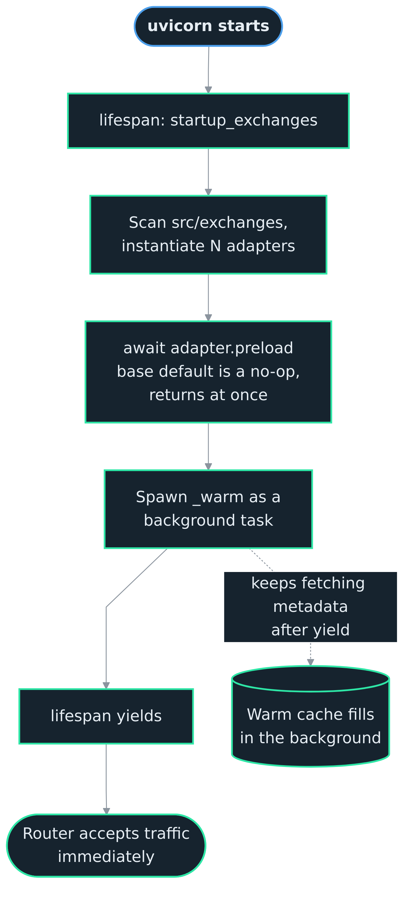
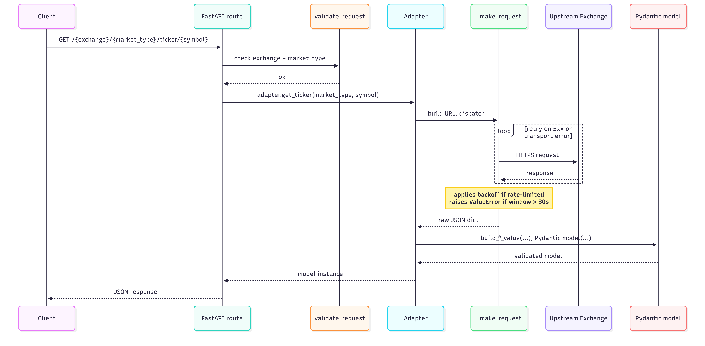
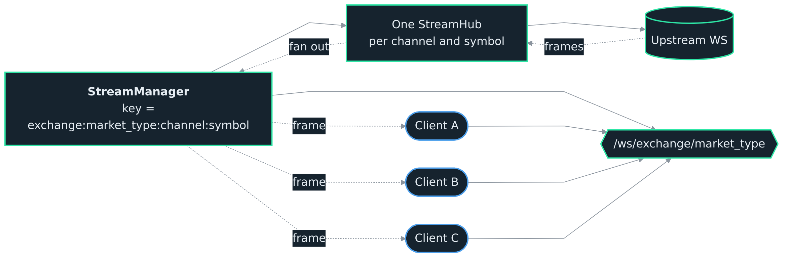
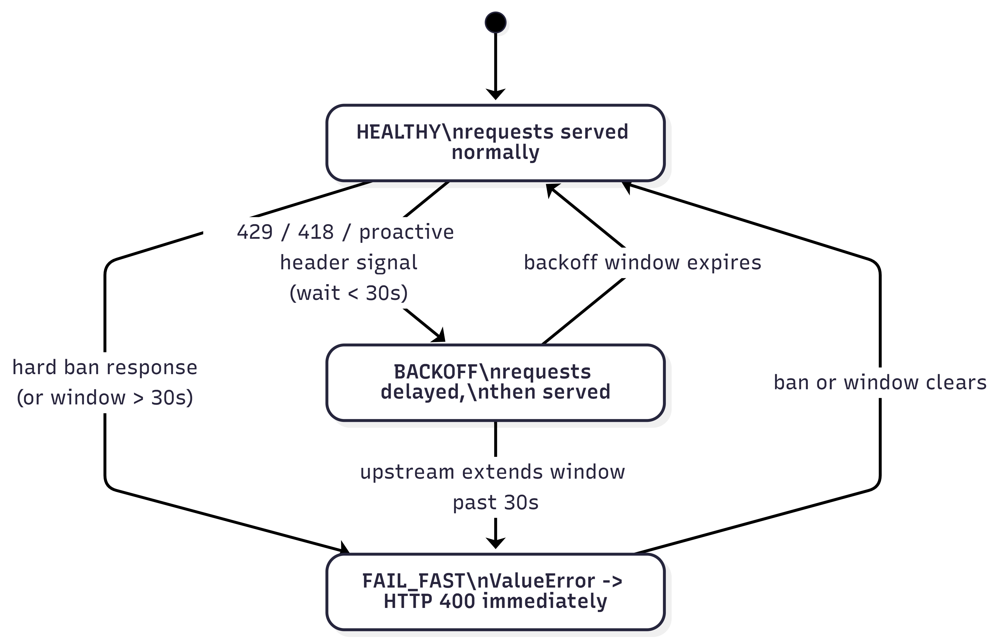

<h1>OCEΛNO <small><code>exchange-router-service</code></small></h1>

  
  
  

  <a href="../README.md">Introduction</a> &nbsp;•&nbsp; 
  <a href="API_Reference.md">API Reference</a> &nbsp;•&nbsp; 
  <a href="Python_SDK.md">Python SDK</a> &nbsp;•&nbsp; 
  <a href="Exchange_Notes.md">Exchange Notes</a> &nbsp;•&nbsp; 
  <b>System Architecture</b> &nbsp;•&nbsp; 
  <a href="Auditor_Guide.md">Auditor Guide</a> &nbsp;•&nbsp; 
  <a href="Contributor_Guide.md">Contributor Guide</a>

 
 
 
 

## System Architecture

One FastAPI process, one adapter per exchange behind a routing layer that never branches on which exchange it is calling. REST and WebSocket share the port and the adapter instance.

 
 

## Core Design

The router uses an abstract base contract (`BaseExchange`). Each exchange is an isolated adapter that implements it; the routing core never needs to know which exchange it is talking to. The loader in `src/exchanges/__init__.py` scans the directory at startup, instantiates every `BaseExchange` subclass it finds, and registers them in `EXCHANGE_REGISTRY`. Adding a new exchange is a matter of dropping a compliant adapter into that directory and restarting.

The wire contract is pinned to an integer `schema_version` field returned at `GET /`; the full record shapes live in [API Reference](API_Reference.md#response-shapes). Adapters never construct nested value objects by hand: they call shared `build_*` helpers in `src/exchanges/base.py` (`build_qty_value`, `build_volume_value`, `build_oi_value`, `build_funding_current`, `build_funding_historical`, `build_funding_convention`). This keeps the conversion logic in one place and the adapter authoring cost low.

Before deploying outside localhost, see [Security and Exposure](#security-and-exposure).

 
 

## Startup Lifecycle

The FastAPI `lifespan` handler in `src/main.py` runs in three phases when the service starts:

1. **Adapter loading.** `load_exchanges()` scans `src/exchanges/` and instantiates every `BaseExchange` subclass. Each adapter's `__init__` is synchronous and lightweight; it does not hit the network.
2. **Preload.** For every registered adapter, the lifespan handler calls `await adapter.preload()`. `preload()` is a sealed template on `BaseExchange`: if the adapter overrides `_warm()`, the base class spawns it as a background task and returns immediately. The handler does not block; the router accepts traffic right away. Inside `_warm()`, adapters call `await self._step("label", awaitable)` once per logical warm; the base class times each step and emits a structured log timeline (`[adapter] preload: warming X...`, `[adapter] preload: X ready in Ts`, `[adapter] preload: done in Ts`). Cross-adapter parallelism is preserved (each adapter's warm chain runs in its own background task); within an adapter, steps run sequentially so the log reads as a chronological per-adapter timeline. During the warm window any route that depends on a cache being primed triggers the same fetch the warm step would have performed (the first request to need it does the work under the cache lock, and the warm step finds it already filled); OKX funding intervals additionally fall back to a per-symbol on-demand lookup. Correctness is preserved either way at the cost of a few extra upstream calls until the warm catches up. SymbolInfo caches are owned by `BaseExchange` and refresh at most once per 24 hours after the initial fill; a failed refresh serves the cached copy and retries after an hour.
3. **Yield.** The service is now serving. Shutdown reverses this: stream-manager teardown first, then `adapter.shutdown()` per adapter to close HTTP clients and WS connections.

  
  
<i>Each adapter declares its warm steps in `_warm()`; the base class spawns the chain in a background task and returns immediately, so the router accepts traffic without waiting</i>

 
 

## Request Lifecycle

Every REST request follows the same path:

  
  
<i>REST lifecycle: route validation, adapter dispatch, retry-aware upstream call, Pydantic normalization, JSON response</i>

 

The route resolves the exchange name to its registered adapter, the adapter makes an async upstream call, and the raw JSON is mapped to a Pydantic model from `src/models.py` before returning. Raw dicts never cross the boundary.

 
 

## WebSocket Lifecycle

WebSocket streams do not follow the same path as REST. The `StreamManager` in `src/stream_manager.py` sits between clients and the adapter's streaming methods.

When a client subscribes to a `(channel, symbol)` tuple on an exchange, the manager builds a key of the form `{exchange}:{market_type}:{channel}:{symbol}` and checks whether an upstream task already exists for it.

  
  
<i>One upstream WebSocket per (channel, symbol) tuple, fanned out to every attached client; cancelled when the last subscriber leaves</i>

 

1. **First subscriber.** The manager starts an async task that opens a single upstream WebSocket via `adapter.stream_*(market_type, symbol)`. Every message produced by the adapter is fanned out to all local clients registered under the same key.
2. **Additional subscribers.** New clients attach to the existing task. No new upstream connection is opened, which keeps the router well under per-IP connection limits on exchanges that enforce them.
3. **Last subscriber leaves.** The manager cancels the upstream task and releases its resources. The next subscriber to the same tuple starts a fresh connection.
4. **Upstream failure.** If the adapter's stream terminates (network drop, exchange-side reset), the manager closes every attached client with code `1011` and clears the entry. Clients are expected to reconnect and re-subscribe.

This is also why re-subscribing on the same connection is not supported. Each connection is bound to one stream task, and the router has no mechanism for moving a client between tasks.

 
 

## Rate Limiting

The backoff and fail-fast flow lives here; user-facing behaviour and per-exchange specifics live in [Exchange Notes](Exchange_Notes.md#rate-limit-and-ban-protection); implementation patterns and header names live in [Contributor Guide](Contributor_Guide.md#rate-limit-headers-and-proactive-backoff).

Each adapter holds a shared `_backoff_until` timestamp guarded by an `asyncio.Lock` (Binance keys it per upstream host, since api, fapi, and dapi carry independent weight buckets). Requests run in parallel by default, but every request consults the timestamp before issuing and sleeps until it clears if a backoff window is active. The lock only protects writes to the timestamp; reads are racy but harmless because the worst case is one extra request slipping through the boundary of a window. When the remaining backoff is large, some adapters fail fast with an `UpstreamUnavailableError` rather than blocking the caller: Bybit and KuCoin fail at 30s, OKX at 60s. Binance sleeps through the backoff and retries, using the upstream's `Retry-After` header (or 5s default) for rate-limit waits with up to 3 retries; Kraken uses exponential backoff with full jitter capped at 60s per attempt, up to 8 retries on Spot REST and 5 on Futures, then fails with `UpstreamUnavailableError`. Per-adapter specifics live in [Exchange Notes](Exchange_Notes.md#rate-limit-and-ban-protection).

  
  
<i>The per-request path: wait out any active host backoff, throttle proactively when the used-weight header nears the budget, honor Retry-After on 429 or 418, and fail fast with 503 plus Retry-After once retries are spent</i>

 
 

## Error Handling

The router normalizes failures into a small set of HTTP responses. It helps to separate what adapters raise from what the route layer emits, because adapter authors only need to worry about the first list.

Adapters raise four exception types:

* **`ValueError`** for bad input or upstream validation failures (unknown symbol, out-of-range limit, an interval or period not declared in the capability map, adapter-side parameter rejections). A global exception handler in `main.py` converts these into `400 Bad Request`, preserving the message in `detail`. The route layer itself raises `ValueError` for undeclared `interval` / `period` values before the adapter is called, validated against the capability map.
* **`UpstreamUnavailableError`** (defined in `src/exchanges/base.py`, a subclass of `AdapterError`, not `ValueError`) when the upstream is throttling or has banned the IP: active backoff windows past the adapter's fail-fast threshold (30s on Bybit and KuCoin, 60s on OKX), Bybit 403 bans, an upstream 5xx that survives the retry budget, and any adapter's exhausted retry budget (message `"Max retries exceeded for {url}"`). The handler in `main.py` converts these into `503 Service Unavailable` with a `Retry-After` header when the adapter knows the wait.
* **`NotImplementedError`** when the adapter does not implement a method for a given market type. The base class raises this by default, and the route layer catches it and returns `501 Not Implemented`.
* **`pydantic.ValidationError`** when an upstream response cannot be normalized into the schema. A `ValidationError` is not a `ValueError` in pydantic v2, and its own handler in `main.py` returns `502 Bad Upstream Response`. Any other uncaught exception falls through to a generic handler that returns `500 Internal Server Error`.

The route layer adds three more responses that adapters never raise themselves:

* **`404 Not Found`** when the exchange name is not in `EXCHANGE_REGISTRY`. Raised directly by `validate_request` before the adapter is ever called.
* **`400 Bad Request`** when the market type is known but the adapter does not declare support for it. Also raised by `validate_request`, checked against each adapter's `supported_market_types` list.
* **`422 Unprocessable Entity`** when a path or query parameter fails FastAPI's pydantic validation (for example, an unrecognised `market_type` enum value). Raised by FastAPI before the route handler runs.

One more condition does not correspond to an exception type at all:

* **Upstream rate limiting** (429 or 418, or proactive detection via response headers) causes the adapter to wait for the declared backoff window before retrying. The client request is delayed, not rejected. When the wait exceeds the adapter's fail-fast threshold (30s on Bybit and KuCoin, 60s on OKX), the adapter raises `UpstreamUnavailableError` instead, which falls under the second bullet above. Binance and Kraken do not implement a single fail-fast cutoff; they sleep and retry until the upstream clears or the retry budget exhausts, then raise `UpstreamUnavailableError` (Kraken bounds total backoff at ~4 minutes).

The `detail` field in error responses always carries the underlying exception message, whether it came from the adapter or the upstream exchange. Nothing is rewritten or swallowed.

 
 

## Versioning Policy

The router carries two version numbers, defined in [src/version.py](../src/version.py) and surfaced through separate endpoints.

* **`SERVICE_VERSION`** is the standard semver string (`MAJOR.MINOR.PATCH`). It bumps for any user-visible change: a new route, a new field, a behavioural fix, a capability adjustment, a dependency upgrade. Returned at `GET /version` and `GET /`.
* **`SCHEMA_VERSION`** is a small integer. It bumps only when the wire format breaks consumer code: renaming a field, flattening a nested object into top-level fields, removing a discriminator value, changing the type of a field. Adding an optional field does not bump. Returned at `GET /` and stamped on every auditor `results.json`; the auditor compares served-vs-pinned and fails the suite on drift.

The two version numbers are decoupled on purpose. A wire-compatible bug fix bumps `SERVICE_VERSION` and leaves `SCHEMA_VERSION` untouched, so clients pinned to a schema number do not need to recompile. A genuine wire break bumps both.

 
 

## Deployment Notes

The router is designed to run as a single container per exchange IP. A few consequences follow from that.

* **Rate limit state is in-memory.** Each router instance tracks its own backoff timestamps and per-adapter locks. Running two router instances behind a load balancer that both hit the same exchange from the same IP will double-count request weight and risk an IP ban. If you need horizontal scaling, shard exchanges across instances rather than replicating them.
* **No persistence.** The service holds no database, no cache, no on-disk state. Historical data is always pulled from upstream on demand. A restart loses only in-flight requests and WebSocket sessions.
* **No built-in observability.** The router logs to stdout via Python's `logging` module. Metrics and traces are not emitted. If you need them, wrap the service at the edge (reverse proxy, sidecar) or add them directly to the adapter layer.
* **CORS is open.** `allow_origins=["*"]` is set so any local client can talk to the router during development. If you expose the router beyond localhost, put it behind a proxy that enforces origin checks.

These are intentional constraints that keep the service stateless and straightforward to restart. Understand them before pointing real traffic at the service.

 
 

## Security and Exposure

The router is designed for localhost or a trusted network. It ships without authentication, inbound rate limiting (only outbound), request signing, TLS termination, or origin enforcement. Anyone who can reach the port can issue any request the adapters support.

Every response is public market data, so a compromised router cannot leak private information or move funds. The real risk is being abused as an open proxy: a misbehaving caller hammering upstream exchanges from your IP. That is how IP bans happen.

If you run the router outside a trusted network, put it behind a reverse proxy that adds TLS, an allowlist or origin check, and an inbound rate limit tight enough that one misbehaving client cannot exhaust the upstream budget. A minimal nginx or Caddy config is enough. Per-client quotas, audit logging, and API keys belong in that proxy layer, not in the router. If you run multiple Oceano services behind the same proxy, give the router its own subpath or hostname and keep the port private; CORS is wildcard-open by design for local development.
