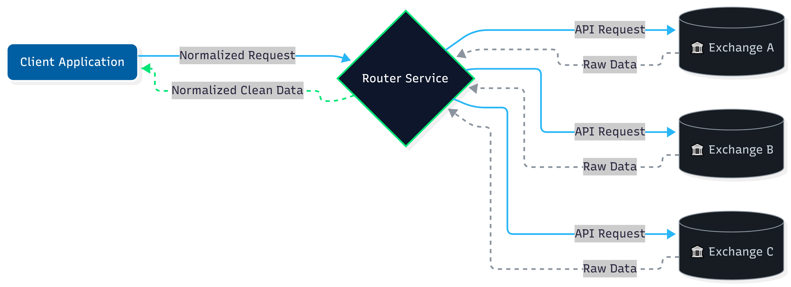

<h1>OCEΛNO <small><code>exchange-router-service</code></small></h1>


<div style="padding-top: 0px;">
  <a href="https://www.python.org/downloads/"></a>
  <a href="https://fastapi.tiangolo.com/"></a>
  <a href="https://opensource.org/licenses/MIT"></a>
</div>

<sub>
  <b>Introduction</b> &nbsp;•&nbsp; 
  <a href=".Documentation/API_Reference.md">API Reference</a> &nbsp;•&nbsp; 
  <a href=".Documentation/Python_SDK.md">Python SDK</a> &nbsp;•&nbsp; 
  <a href=".Documentation/Exchange_Notes.md">Exchange Notes</a> &nbsp;•&nbsp; 
  <a href=".Documentation/System_Architecture.md">System Architecture</a> &nbsp;•&nbsp; 
  <a href=".Documentation/Validator_Guide.md">Validator Guide</a> &nbsp;•&nbsp; 
  <a href=".Documentation/Contributor_Guide.md">Contributor Guide</a>
</sub>

<br>
<br>
<br>
<br>

## Introduction

The `exchange-router-service` is an async API gateway for public cryptocurrency market data. It sits in front of multiple exchanges and normalizes their REST and WebSocket APIs into a single consistent schema. You write one client instead of many.

The service handles the parts that every exchange integration ends up needing: pagination for large historical pulls, request-weight throttling to prevent IP bans, and persistent connection management for WebSocket streams. Adding a new exchange is a matter of dropping in a new adapter, with no changes to the routing core.

**Stateless and keyless.** The service handles public market data only. It places no orders, holds no API keys, manages no accounts, and persists nothing to disk. If you need authentication or private endpoints, this is not it.

<br>

<div align="center">
  
  <p style="margin: 0;"><i>Architecture: Client -> Router -> Multiple Exchanges</i></p>
</div>

<br>

Clients talk to one endpoint, the router routes requests to the right exchange adapter, and the adapter normalizes the response into a schema that is identical across exchanges. REST and WebSocket both sit on the same port, and the same adapter instance serves both, so a client written against Binance spot works against Bybit linear with a single path change. The schema is uniform; some unit semantics are not. See [Exchange Notes](.Documentation/Exchange_Notes.md) before comparing values across markets; each exchange's section calls out the fields whose units differ.

<br>
<br>

## Supported Exchanges

<table style="width: 100%; border-collapse: collapse; margin-top: 16px; font-size: 0.9em;">
  <thead>
    <tr style="border-bottom: 2px solid #30363d; background: transparent;">
      <th style="padding: 12px; text-align: left;">Exchange</th>
      <th style="padding: 12px; text-align: left;">Market</th>
      <th style="padding: 12px; text-align: center;">OHLCV</th>
      <th style="padding: 12px; text-align: center;">Ticker</th>
      <th style="padding: 12px; text-align: center;">DOM</th>
      <th style="padding: 12px; text-align: center;">Trades</th>
      <th style="padding: 12px; text-align: center;">OI / FR</th>
      <th style="padding: 12px; text-align: center;">L/S Ratio</th>
      <th style="padding: 12px; text-align: left;">WebSocket Streams</th>
    </tr>
  </thead>
  <tbody>
    <!-- Binance -->
    <tr style="border-bottom: 1px solid #30363d;">
      <td rowspan="3" style="padding: 12px; vertical-align: middle; text-align: left; border-right: 1px solid #30363d;">
        
      </td>
      <td style="padding: 8px 12px; opacity: 0.8;">Spot</td>
      <td style="padding: 8px; text-align: center;">[x]</td>
      <td style="padding: 8px; text-align: center;">[x]</td>
      <td style="padding: 8px; text-align: center;">[x]</td>
      <td style="padding: 8px; text-align: center;">[x]</td>
      <td style="padding: 8px; text-align: center; opacity: 0.3;">[ ]</td>
      <td style="padding: 8px; text-align: center; opacity: 0.3;">[ ]</td>
      <td style="padding: 8px; text-align: left; font-size: 0.85em; max-width: 250px;">Ticker, Book Ticker, Trades, Agg Trades, Orderbook</td>
    </tr>
    <tr style="border-bottom: 1px solid #30363d;">
      <td style="padding: 8px 12px; opacity: 0.8;">Linear</td>
      <td style="padding: 8px; text-align: center;">[x]</td>
      <td style="padding: 8px; text-align: center;">[x]</td>
      <td style="padding: 8px; text-align: center;">[x]</td>
      <td style="padding: 8px; text-align: center;">[x]</td>
      <td style="padding: 8px; text-align: center;">[x]</td>
      <td style="padding: 8px; text-align: center;">[x]</td>
      <td style="padding: 8px; text-align: left; font-size: 0.85em; max-width: 250px;">Ticker, Book Ticker, Trades, Agg Trades, Orderbook, Mark Price, Liquidations</td>
    </tr>
    <tr style="border-bottom: 2px solid #30363d;">
      <td style="padding: 8px 12px; opacity: 0.8;">Inverse</td>
      <td style="padding: 8px; text-align: center;">[x]</td>
      <td style="padding: 8px; text-align: center;">[x]</td>
      <td style="padding: 8px; text-align: center;">[x]</td>
      <td style="padding: 8px; text-align: center;">[x]</td>
      <td style="padding: 8px; text-align: center;">[x]</td>
      <td style="padding: 8px; text-align: center;">[x]</td>
      <td style="padding: 8px; text-align: left; font-size: 0.85em; max-width: 250px;">Ticker, Book Ticker, Trades, Agg Trades, Orderbook, Mark Price, Liquidations</td>
    </tr>
    <!-- Bybit -->
    <tr style="border-bottom: 1px solid #30363d;">
      <td rowspan="3" style="padding: 12px; vertical-align: middle; text-align: left; border-right: 1px solid #30363d;">
        
      </td>
      <td style="padding: 8px 12px; opacity: 0.8;">Spot</td>
      <td style="padding: 8px; text-align: center;">[x]</td>
      <td style="padding: 8px; text-align: center;">[x]</td>
      <td style="padding: 8px; text-align: center;">[x]</td>
      <td style="padding: 8px; text-align: center;">[x]</td>
      <td style="padding: 8px; text-align: center; opacity: 0.3;">[ ]</td>
      <td style="padding: 8px; text-align: center; opacity: 0.3;">[ ]</td>
      <td style="padding: 8px; text-align: left; font-size: 0.85em; max-width: 250px;">Ticker, Book Ticker, Trades, Orderbook</td>
    </tr>
    <tr style="border-bottom: 1px solid #30363d;">
      <td style="padding: 8px 12px; opacity: 0.8;">Linear</td>
      <td style="padding: 8px; text-align: center;">[x]</td>
      <td style="padding: 8px; text-align: center;">[x]</td>
      <td style="padding: 8px; text-align: center;">[x]</td>
      <td style="padding: 8px; text-align: center;">[x]</td>
      <td style="padding: 8px; text-align: center;">[x]</td>
      <td style="padding: 8px; text-align: center;">[x]</td>
      <td style="padding: 8px; text-align: left; font-size: 0.85em; max-width: 250px;">Ticker, Book Ticker, Trades, Orderbook, Liquidations</td>
    </tr>
    <tr style="border-bottom: 2px solid #30363d;">
      <td style="padding: 8px 12px; opacity: 0.8;">Inverse</td>
      <td style="padding: 8px; text-align: center;">[x]</td>
      <td style="padding: 8px; text-align: center;">[x]</td>
      <td style="padding: 8px; text-align: center;">[x]</td>
      <td style="padding: 8px; text-align: center;">[x]</td>
      <td style="padding: 8px; text-align: center;">[x]</td>
      <td style="padding: 8px; text-align: center;">[x]</td>
      <td style="padding: 8px; text-align: left; font-size: 0.85em; max-width: 250px;">Ticker, Book Ticker, Trades, Orderbook, Liquidations</td>
    </tr>
    <!-- Kraken -->
    <tr style="border-bottom: 1px solid #30363d;">
      <td rowspan="3" style="padding: 12px; vertical-align: middle; text-align: left; border-right: 1px solid #30363d;">
        
      </td>
      <td style="padding: 8px 12px; opacity: 0.8;">Spot</td>
      <td style="padding: 8px; text-align: center;">[x]</td>
      <td style="padding: 8px; text-align: center;">[x]</td>
      <td style="padding: 8px; text-align: center;">[x]</td>
      <td style="padding: 8px; text-align: center;">[x]</td>
      <td style="padding: 8px; text-align: center; opacity: 0.3;">[ ]</td>
      <td style="padding: 8px; text-align: center; opacity: 0.3;">[ ]</td>
      <td style="padding: 8px; text-align: left; font-size: 0.85em; max-width: 250px;">Ticker, Book Ticker, Trades, Orderbook</td>
    </tr>
    <tr style="border-bottom: 1px solid #30363d;">
      <td style="padding: 8px 12px; opacity: 0.8;">Linear</td>
      <td style="padding: 8px; text-align: center;">[x]</td>
      <td style="padding: 8px; text-align: center;">[x]</td>
      <td style="padding: 8px; text-align: center;">[x]</td>
      <td style="padding: 8px; text-align: center;">[x]</td>
      <td style="padding: 8px; text-align: center;">[x]</td>
      <td style="padding: 8px; text-align: center;">[x]</td>
      <td style="padding: 8px; text-align: left; font-size: 0.85em; max-width: 250px;">Ticker, Book Ticker, Trades, Orderbook, Mark Price</td>
    </tr>
    <tr style="border-bottom: 2px solid #30363d;">
      <td style="padding: 8px 12px; opacity: 0.8;">Inverse</td>
      <td style="padding: 8px; text-align: center;">[x]</td>
      <td style="padding: 8px; text-align: center;">[x]</td>
      <td style="padding: 8px; text-align: center;">[x]</td>
      <td style="padding: 8px; text-align: center;">[x]</td>
      <td style="padding: 8px; text-align: center;">[x]</td>
      <td style="padding: 8px; text-align: center;">[x]</td>
      <td style="padding: 8px; text-align: left; font-size: 0.85em; max-width: 250px;">Ticker, Book Ticker, Trades, Orderbook, Mark Price</td>
    </tr>
    <!-- OKX -->
    <tr style="border-bottom: 1px solid #30363d;">
      <td rowspan="3" style="padding: 12px; vertical-align: middle; text-align: left; border-right: 1px solid #30363d;">
        
      </td>
      <td style="padding: 8px 12px; opacity: 0.8;">Spot</td>
      <td style="padding: 8px; text-align: center;">[x]</td>
      <td style="padding: 8px; text-align: center;">[x]</td>
      <td style="padding: 8px; text-align: center;">[x]</td>
      <td style="padding: 8px; text-align: center;">[x]</td>
      <td style="padding: 8px; text-align: center; opacity: 0.3;">[ ]</td>
      <td style="padding: 8px; text-align: center; opacity: 0.3;">[ ]</td>
      <td style="padding: 8px; text-align: left; font-size: 0.85em; max-width: 250px;">Ticker, Book Ticker, Trades, Orderbook</td>
    </tr>
    <tr style="border-bottom: 1px solid #30363d;">
      <td style="padding: 8px 12px; opacity: 0.8;">Linear</td>
      <td style="padding: 8px; text-align: center;">[x]</td>
      <td style="padding: 8px; text-align: center;">[x]</td>
      <td style="padding: 8px; text-align: center;">[x]</td>
      <td style="padding: 8px; text-align: center;">[x]</td>
      <td style="padding: 8px; text-align: center;">[x]</td>
      <td style="padding: 8px; text-align: center;">[x]</td>
      <td style="padding: 8px; text-align: left; font-size: 0.85em; max-width: 250px;">Ticker, Book Ticker, Trades, Orderbook, Mark Price, Liquidations</td>
    </tr>
    <tr style="border-bottom: 2px solid #30363d;">
      <td style="padding: 8px 12px; opacity: 0.8;">Inverse</td>
      <td style="padding: 8px; text-align: center;">[x]</td>
      <td style="padding: 8px; text-align: center;">[x]</td>
      <td style="padding: 8px; text-align: center;">[x]</td>
      <td style="padding: 8px; text-align: center;">[x]</td>
      <td style="padding: 8px; text-align: center;">[x]</td>
      <td style="padding: 8px; text-align: center;">[x]</td>
      <td style="padding: 8px; text-align: left; font-size: 0.85em; max-width: 250px;">Ticker, Book Ticker, Trades, Orderbook, Mark Price, Liquidations</td>
    </tr>
    <!-- KuCoin -->
    <tr style="border-bottom: 1px solid #30363d;">
      <td rowspan="3" style="padding: 12px; vertical-align: middle; text-align: left; border-right: 1px solid #30363d;">
        
      </td>
      <td style="padding: 8px 12px; opacity: 0.8;">Spot</td>
      <td style="padding: 8px; text-align: center;">[x]</td>
      <td style="padding: 8px; text-align: center;">[x]</td>
      <td style="padding: 8px; text-align: center;">[x]</td>
      <td style="padding: 8px; text-align: center;">[x]</td>
      <td style="padding: 8px; text-align: center; opacity: 0.3;">[ ]</td>
      <td style="padding: 8px; text-align: center; opacity: 0.3;">[ ]</td>
      <td style="padding: 8px; text-align: left; font-size: 0.85em; max-width: 250px;">Ticker, Book Ticker, Trades, Orderbook</td>
    </tr>
    <tr style="border-bottom: 1px solid #30363d;">
      <td style="padding: 8px 12px; opacity: 0.8;">Linear</td>
      <td style="padding: 8px; text-align: center;">[x]</td>
      <td style="padding: 8px; text-align: center;">[x]</td>
      <td style="padding: 8px; text-align: center;">[x]</td>
      <td style="padding: 8px; text-align: center;">[x]</td>
      <td style="padding: 8px; text-align: center;">[x]</td>
      <td style="padding: 8px; text-align: center; opacity: 0.3;">[ ]</td>
      <td style="padding: 8px; text-align: left; font-size: 0.85em; max-width: 250px;">Ticker, Book Ticker, Trades, Orderbook, Mark Price</td>
    </tr>
    <tr style="border-bottom: 1px solid #30363d;">
      <td style="padding: 8px 12px; opacity: 0.8;">Inverse</td>
      <td style="padding: 8px; text-align: center;">[x]</td>
      <td style="padding: 8px; text-align: center;">[x]</td>
      <td style="padding: 8px; text-align: center;">[x]</td>
      <td style="padding: 8px; text-align: center;">[x]</td>
      <td style="padding: 8px; text-align: center;">[x]</td>
      <td style="padding: 8px; text-align: center; opacity: 0.3;">[ ]</td>
      <td style="padding: 8px; text-align: left; font-size: 0.85em; max-width: 250px;">Ticker, Book Ticker, Trades, Orderbook, Mark Price</td>
    </tr>
  </tbody>
</table>

<small><i>*WebSocket streams provide real-time updates for the listed channels. See the <a href=".Documentation/API_Reference.md#websocket-streams">API Reference</a> for full channel specs and subscription payloads.</i></small>

<br>
<br>

## Quick Start

The service runs as a stateless Docker container.

```bash
# Clone and enter the directory
git clone https://github.com/atOCEANO/exchange-router-service.git
cd exchange-router-service

# Configure environment
cp .env.example .env

# Launch the service
docker-compose up -d --build

# Verify the service is running (if this fails, check logs with: docker-compose logs -f)
curl http://localhost:8040/status

# Fetch Binance Spot Ticker
curl http://localhost:8040/binance/spot/ticker/BTCUSDT
```

<br>

The only knob exposed at deploy time is the host port:

| Variable | Required | Default | Purpose |
| :--- | :--- | :--- | :--- |
| `EXCHANGE_ROUTER_SERVICE_PORT` | Yes | `8040` | Host port that Docker publishes. The container always binds `8040` internally. Change this if `8040` is already taken on the host, or if you run multiple router instances on the same machine. |

<br>

This variable lives in `.env` and is consumed by `docker-compose.yml` in the `ports` mapping. There is no configuration file for adapters, upstream URLs, timeouts, or rate-limit thresholds. Those are defined in code, per adapter, and changing them means editing the adapter and rebuilding the container. This is intentional, the router ships as a single immutable image and should behave identically across deployments.

<br>
<br>

## Python SDK

A thin async client over the router's REST and WebSocket interfaces. Historical and time-series methods return `pandas.DataFrame` objects indexed by datetime; point-in-time snapshots (ticker, book ticker, orderbook, mark price) return plain dicts. See [Exchange Notes](.Documentation/Exchange_Notes.md) for fields whose units vary across exchanges.

```bash
pip install git+https://github.com/atOCEANO/exchange-router-service.git#subdirectory=client
```

```python
from exchange_router_client import ExchangeRouterClient

client = ExchangeRouterClient("http://localhost:8040")

df = await client.get_candles("binance", "spot", "BTCUSDT", interval="1h", limit=500)
print(df.tail())

await client.close()
```

Fetch candles for every symbol on an exchange in one call:

```python
from exchange_router_client import ExchangeRouterClient

client = ExchangeRouterClient("http://localhost:8040")

# Discover every active Binance spot market
all_markets = await client.get_markets(exchange="binance", market_type="spot")

all_markets[:5]
# ['BTCUSDT', 'ETHUSDT', 'BNBUSDT', 'SOLUSDT', 'XRPUSDT']

f"Total spot markets: {len(all_markets)}"
# 'Total spot markets: 517'

# Fetch 1000 daily candles for all of them, 5 requests at a time
data_map = await client.fetch_multi_candles(
    exchange="binance",
    market_type="spot",
    symbols=all_markets,
    interval="1d",
    limit=1000,
    max_concurrent=5,
)

f"Fetched {len(data_map)} markets"
# 'Fetched 517 markets'

data_map["BTCUSDT"].tail()
#                        open      high       low     close       volume
# datetime
# 2025-04-21  84389.97  85300.00  83500.00  84500.01  21345.82
# ...

await client.close()
```
